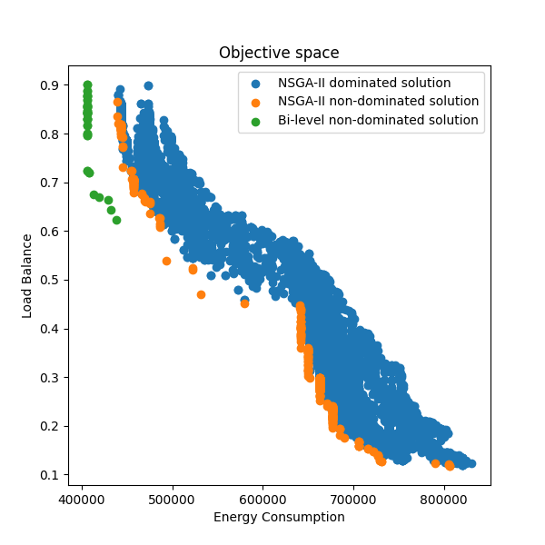
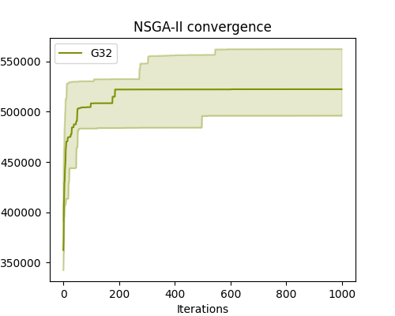
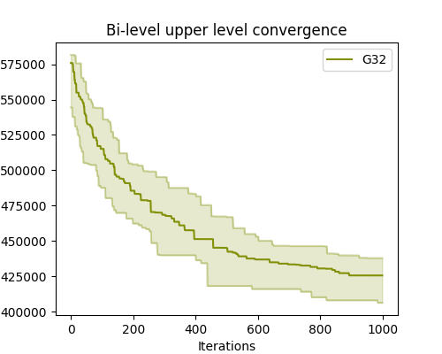
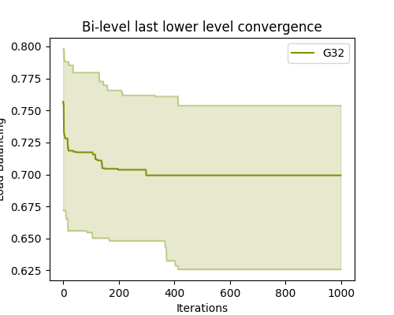

# Optimizing 2D-Mesh Network-on-Chip System Design: Multi-Objective vs. Bi-level Approaches to Energy Efficiency and Load Balancing

**Please visit [Github repository](https://github.com/dathd6/NoC-Design-Optimization) to see the README.md in better format**

## About the code

- Programming language: Python
- Version: 3.11.9

## Dependencies:
- [matplotlib](https://matplotlib.org)
- networkx
- seaborn
- numpy
- pymoo
- sckit-learn
- scipy

## File structure:

- [optimize.py](./main.py): contained the main code to optimize NoC applications
- [visualize.py](./visualize.py): contained the main code to visualize all figures
- [constant.py](./constants.py): constant variables
- [noc.py](./problem/noc.py): fitness function, NoC decision variables
- [core](./core/): initialization, selection, crossover, mutation, replacement, sorting functions
- [algorithms](./algorithms/): Folder contains all optimization algorithms (NSGA-II and Bi-level)
- [requirements.txt](./requirements.txt): requirement's packages/libraries
- [README.md](./README.md): Documentation for the code
- [datasets/](./datasets): Folder (datasets) contains NoC application task graph

## Pre-execution

- [Install Latest version of Python3](https://www.python.org/downloads/)

- [Install virtualenv](https://virtualenv.pypa.io/en/latest/installation.html)

Open terminal and `cd` to the code directory then create virtual environment
```bash
virtualenv env
```

Activate virtual environment
```bash
source env/bin/activate
```
 
Install dependencies
```bash
pip install -r requirements.txt
```

(OPTIONAL) Printout help option
```bash
python3 optimize.py --help
python3 visualize.py --help
```

Example of optimization

```bash
python3 optimize.py --core-graph "./dataset/bandwidth/G32.txt" \
                    --rows 6 \
                    --columns 6 \
                    --experiments 10 \
                    --population 1000 \
                    --tournament 200 \ 
                    --iterations 1000 \
                    --nsga-ii 

python3 optimize.py --core-graph "./dataset/bandwidth/G32.txt" \
                    --rows 6 \
                    --columns 6 \
                    --experiments 10 \
                    --population 1000 \
                    --tournament 200 \ 
                    --iterations 1000 \
                    --bi-level 
                    --old-population
```

Example of visualization
```bash
python3 visualize.py --application G32 \
                     --color #EA1000 \
                     --objective-space \
                     --optimal-fitness \
                     --algorithm-animation \
                     --convergence-plot
```

## Execution

Easier way to run our experiments
```bash
chmod +x execute.sh
bash execute.sh
```

What we did are not run all the applications at the same time but modifying the execute.sh to run each applications seperately (faster)

## View Results

Folder [output.sample](./output.sample) contains the sample output of application G32
- Analysis folder have all the result figures
- Experiments folder have all the recorded fitnesses 
- Population folder have all the experiments initial populations

Average optimal energy consumption and load balance of sample application (G32) [report.txt](./output.sample/G32/analysis/G32.png)

Objective space:



Convergence plot NSGA-II, Bi-level upper and lower level:





The algorithms animation video: [Animation](./output.sample/G32/analysis/animation.mp4)
